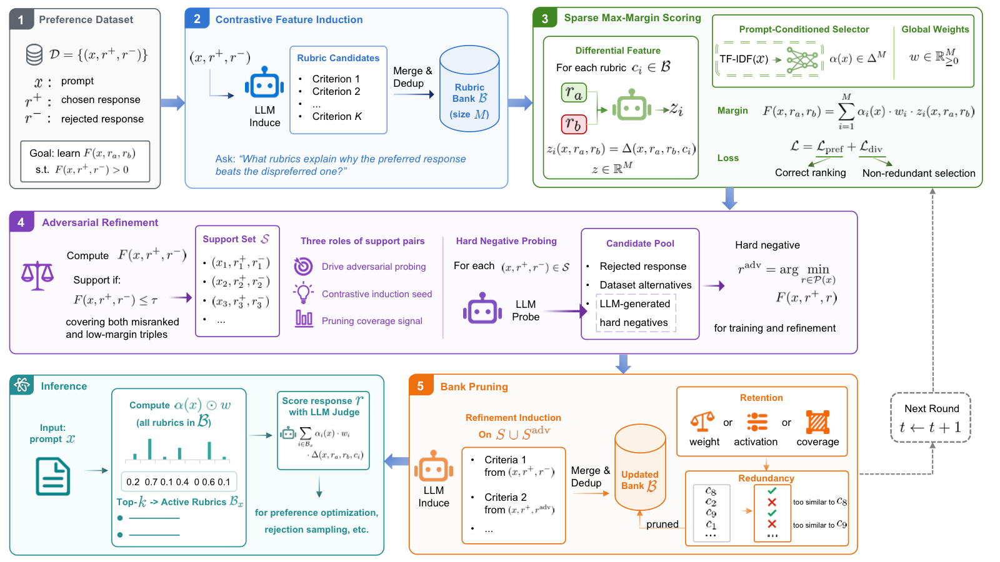
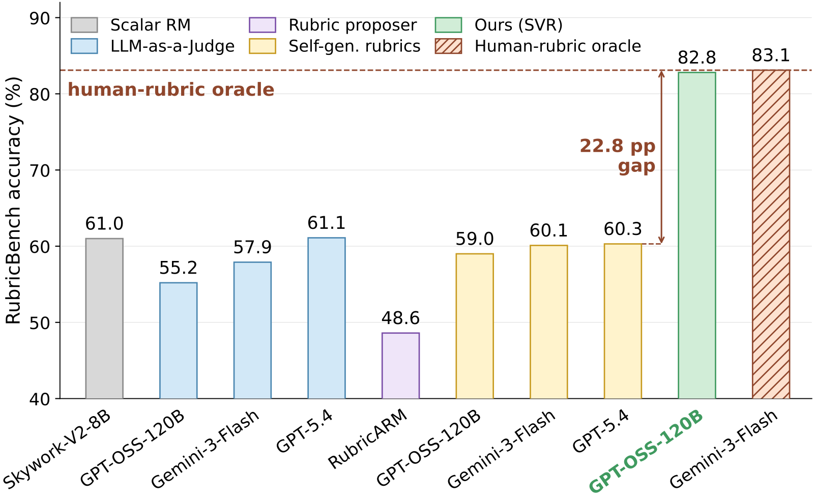

# Support Vector Rubrics (SVR)

Code for **Support Vector Rubrics: Closing the Gap Between Self-Generated and Human Rubrics** (EMNLP 2026 Main Conference).

This repository contains the complete implementation of SVR, a framework that learns discriminative natural-language rubrics from preference data. It also includes [`rrd_rubricbench_repro/`](rrd_rubricbench_repro/), a separate clean-room reproduction of Recursive Rubric Decomposition (RRD) [1]. The RRD code is not imported by SVR and is documented independently in [`rrd_rubricbench_repro/README.md`](rrd_rubricbench_repro/README.md).

[1] Shen W F, Qiu X, Whitehouse C, et al. Rethinking rubric generation for improving llm judge and reward modeling for open-ended tasks[J]. arXiv preprint arXiv:2602.05125, 2026.



## Framework overview

Rubric-based evaluation gives an LLM judge explicit criteria for comparing open-ended responses. The central problem is that prompt-only, self-generated rubrics often describe what a good answer looks like without identifying the criterion that separates two close candidates. SVR addresses this discriminative gap by learning rubrics from preference boundaries rather than generating a fresh rubric for every prompt.

The method has two stages:

1. **Offline construction:** mine a global rubric bank from preference pairs, learn a prompt-conditioned sparse selector and global rubric weights, refine the bank around support pairs and adversarial hard negatives, and prune redundant entries.
2. **Inference:** use only the prompt to select the top-k rubrics, then pass those rubrics and a response pair to an LLM judge. The same bank can be reused across evaluation sets and downstream preference pipelines.

```text
Preference triples (prompt, chosen, rejected)
                    |
                    v
      Contrastive rubric candidate induction
                    |
                    v
             Global rubric bank
                    |
                    v
      Sparse selector + global rubric weights
                    |
                    v
       Support-pair and hard-negative mining
                    |
                    v
        Boundary re-induction and pruning
                    |
                    v
             Reusable SVR checkpoint
                    |
       prompt -> top-k rubrics -> LLM judge
                    |
                    v
             Pairwise preference decision
```

The repository also contains an independent RRD reproduction. RRD samples external responses and constructs prompt-specific rubrics through recursive decomposition. It is useful for reproducing the closest baseline, but it is not required to train or evaluate SVR.

## Repository layout

```text
.
|-- README.md                       # This guide and the complete SVR documentation
|-- SVR/                             # SVR source package and command-line scripts
|   |-- svr/                         # Training, inference, mining, judging, evaluation
|   |-- scripts/                     # SVR train/eval entrypoints
|   |-- configs/                     # Static benchmark mappings
|   `-- assets/                      # Figures used in this README
`-- rrd_rubricbench_repro/           # Independent RRD RubricBench reproduction
    |-- README.md                    # RRD-specific instructions
    |-- pyproject.toml               # Installable package metadata
    |-- src/rrd_rubricbench/         # RRD pipeline, prompts, sampling, evaluation
    |-- scripts/                     # RRD entrypoint
    `-- tests/                       # RRD data, checkpoint, and weighting tests
```

## SVR method

SVR treats each preference example as a triple `(x, r+, r-)`, where `x` is a prompt, `r+` is the preferred response, and `r-` is the rejected response.

1. **Contrastive feature induction.** An LLM proposes criteria that explain why `r+` beats `r-`, rather than only summarizing the ideal response.
2. **Global bank construction.** Candidate rubrics are normalized, deduplicated, similarity-collapsed, and stored as interpretable bank entries.
3. **Sparse max-margin scoring.** A TF-IDF prompt vectorizer feeds a small selector network with a sparsemax output. The selector produces prompt-specific activations `alpha(x)`, while a non-negative global vector `w` calibrates rubric importance.
4. **Support-pair refinement.** Pairs with a low or negative current margin are selected as support pairs. An LLM probe creates plausible hard negatives near the current decision boundary.
5. **Boundary re-induction.** Support pairs and adversarial pairs are sent through contrastive induction again so that newly exposed failure modes add rubrics to the bank.
6. **Bank pruning.** Entries are retained when they have sufficient learned weight, activation rate, or support coverage, then near-duplicates are removed.
7. **Prompt-only inference.** The prompt selects the top-k bank entries before either candidate response is observed. The selected criteria are optionally rewritten for the prompt and used by the pairwise judge.

The default configuration uses three refinement rounds and `top_k=6`. The selector and rubric weights are lightweight. The main runtime cost is the cached LLM calls used during offline construction and pairwise judging.

## Requirements and installation

The SVR implementation requires Python 3.10 or newer and the following runtime packages:

- PyTorch
- NumPy and scikit-learn
- pandas and PyArrow for Parquet benchmarks
- tqdm
- OpenAI Python SDK (`openai>=1.0`)


## LLM endpoint

Training and evaluation call an OpenAI-compatible `/v1` chat-completions endpoint for rubric mining, pairwise scoring, rubric rewriting, and adversarial hard-negative generation.

```bash
export LLM_BASE_URL=http://your-llm-host:8000/v1
export LLM_API_KEY=your_api_key
```

`OPENAI_BASE_URL` and `OPENAI_API_KEY` are accepted as alternatives. The default model name is `gpt-oss-120b`. Pass `--llm-model` to use another model served by the endpoint. The endpoint should accept the request fields used by the OpenAI Python SDK, including `reasoning_effort` when enabled by the served model.

## Input data

The SVR loader accepts JSON, JSONL, and gzip-compressed JSONL files. A training record needs a prompt or conversation plus a chosen and rejected response:

```json
{
  "prompt": "Explain ...",
  "chosen": "A helpful response ...",
  "rejected": "An inferior response ..."
}
```

The loader also supports:

- `response1`/`response2` with numeric `overall_preference`.
- `response_a`/`response_b` with `chosen_candidate` set to `"a"` or `"b"`.
- self-rubric fields `prompt_wise_rubrics`, `self_generated_rubrics`, and `self_rubrics`.
- reference-rubric fields `reference_rubrics`, `oracle_rubrics`, and `benchmark_rubrics`.

Do not train on RubricBench or on test/reference labels. `scripts/run_train.py` rejects training paths containing `rubricbench`, and benchmark labels are consumed only by evaluation scripts.

## Training

### HelpSteer3 preset

This entrypoint uses the paper recipe: a 5% development split, 8 epochs per round, three rounds, and up to 1,024 support pairs per round.

```bash
cd SVR
python scripts/run_train_helpsteer3.py \
  --train-path data/helpsteer3_train.jsonl.gz \
  --output-dir outputs/helpsteer3 \
  --llm-model gpt-oss-120b \
  --llm-base-url "$LLM_BASE_URL" \
  --device cuda
```

### Generic preference data

Use the general entrypoint when the data is not HelpSteer3 or when you want to control the development split and optimization settings:

```bash
python scripts/run_train.py \
  --train-path data/train.jsonl \
  --output-dir outputs/svr \
  --dev-ratio 0.1 \
  --num-rounds 3 \
  --top-k 6 \
  --llm-model gpt-oss-120b \
  --llm-base-url "$LLM_BASE_URL" \
  --device cuda
```

To use an explicit development file, add `--dev-path data/dev.jsonl`. For a smoke test, add `--limit 100` and optionally `--dev-limit 20`. Training resumes from materialized round outputs automatically. Use `--disable-round-resume` to force a fresh run. The HelpSteer3 entrypoint additionally supports `--resume-candidate-cache-dir` and `--require-initial-train-cache` for reusing candidate-mining results.

The main experiments use 36,591 decontaminated HelpSteer3 preference triples, with 5% held out for development. A full three-round run is reported as approximately 20 GPU-hours on one 8 x A100 node. Cached LLM calls can be reused across restarts.

## Training outputs

The output directory is self-contained and publishes the best development round at its root:

```text
outputs/<run>/
|-- model.pt                 # Selector and global rubric weights
|-- bank.json                # Final pruned rubric bank
|-- vectorizer.pkl           # Fitted TF-IDF prompt vectorizer
|-- inference_config.json    # LLM and inference settings
|-- train_summary.json       # Per-round metrics and best-round selection
|-- best_round.json          # Pointer to the selected round checkpoint
|-- round_summary.json       # Published best-round summary
|-- round_01/ ...            # Per-round models, banks, summaries, and caches
`-- llm_cache/               # Cached OpenAI-compatible calls
```

Each round also stores candidate caches and resume state. Keep the output directory when restarting or comparing runs.

## Evaluation

All evaluators load the same trained directory and use the configured LLM as the downstream pairwise judge. Add `--limit N` for a quick check. Outputs default to the model directory. Use `--output-path` and `--details-path` to override them.

### RubricBench

`--test-path` accepts one or more JSON/JSONL files. Use `--domain` repeatedly to select domains and `--with-reference-baseline` to score reference rubrics as an additional diagnostic:

```bash
cd SVR
python scripts/run_eval_rubricbench.py \
  --model-dir outputs/helpsteer3 \
  --test-path data/rubricbench.json \
  --with-reference-baseline \
  --eval-llm-reasoning-effort medium
```

The evaluator writes `rubricbench_eval_summary.json` and `rubricbench_eval_details.jsonl`.

### Self/reference rubric gap

For a preference dataset containing self rubrics and optionally reference rubrics, compare static-rubric judging with SVR:

```bash
python scripts/run_eval.py \
  --model-dir outputs/helpsteer3 \
  --test-path data/test.jsonl \
  --top-k 6 \
  --output-path outputs/helpsteer3/eval_gap.json
```

The summary reports self accuracy, SVR accuracy, reference accuracy when available, tie rate, and the fraction of the self-to-reference gap closed.

### RewardBench, RewardBench 2, and RM-Bench

RewardBench and RewardBench 2 expect Parquet files (or a directory containing the standard file name). RM-Bench expects its JSON file or a directory containing `total_dataset.json`:

```bash
python scripts/run_eval_rewardbench1.py \
  --model-dir outputs/helpsteer3 \
  --test-path data/rewardbench/filtered-00000-of-00001.parquet

python scripts/run_eval_rewardbench2.py \
  --model-dir outputs/helpsteer3 \
  --test-path data/rewardbench2/test-00000-of-00001.parquet

python scripts/run_eval_rmbench.py \
  --model-dir outputs/helpsteer3 \
  --test-path data/rmbench/total_dataset.json
```

Use `--subset NAME` for RewardBench variants, or `--domain NAME` for RM-Bench domains. These evaluators write a JSON summary and a JSONL detail file. Evaluation is asynchronous by default. Lower `--eval-max-concurrency` if the endpoint is rate-limited.

## Python API

The trained bank can be used directly in a ranking or selection pipeline:

```python
from svr.inference import SVRInferenceEngine

engine = SVRInferenceEngine(model_dir="outputs/helpsteer3", device="cpu")
rubrics = engine.select_rubrics("Write a safe and concise answer", top_k=6)
prediction = engine.score_pair(
    prompt_text="Write a safe and concise answer",
    response_a="Candidate A ...",
    response_b="Candidate B ...",
    top_k=6,
)
print(prediction.preferred_side, prediction.weighted_margin)
```

`SVRInferenceEngine` loads `bank.json`, `model.pt`, `vectorizer.pkl`, and `inference_config.json`. It uses the saved inference-time rubric rewriting setting by default.

## RRD reproduction (separate subproject)

[`rrd_rubricbench_repro/`](rrd_rubricbench_repro/) is a clean-room reproduction of the RRD method [1]. It is included to reproduce the closest RRD baseline on RubricBench. It is not part of the SVR training code. Its own package, checkpointing scheme, dependencies, and command are documented in [`rrd_rubricbench_repro/README.md`](rrd_rubricbench_repro/README.md).

## Reproducibility and evaluation policy

- The default SVR random seed is `42` and the default inference setting is `top_k=6`.
- Keep LLM caches and round checkpoints with the corresponding CLI arguments and model names.
- RubricBench, HelpSteer3, RewardBench, RewardBench 2, and RM-Bench are not redistributed here. Download them from their respective releases.
- SVR reference rubrics and benchmark labels are never used to construct or weight the bank.
- Results can vary with the served model, endpoint implementation, model aliases, generation limits, and cache contents.

## Reported results



On RubricBench, the paper reports **82.8%** overall pairwise accuracy for SVR, compared with **83.1%** for the human-rubric oracle and **59.0%** for GPT-OSS-120B with self-generated rubrics. Across RewardBench 1 and 2 and RM-Bench, SVR reports an average of **87.2%** without retraining the bank.

The RRD reproduction reports **57.63%** overall pairwise accuracy on all 1,147 RubricBench examples. This number belongs to the separate baseline reproduction and should not be confused with the SVR result.

